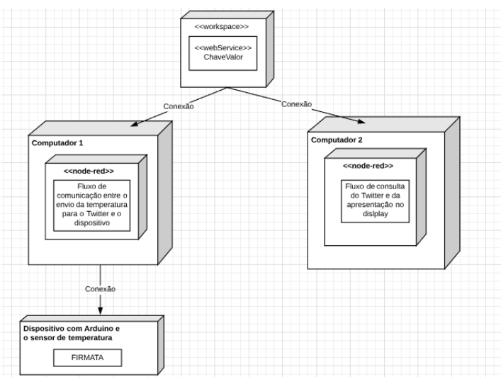
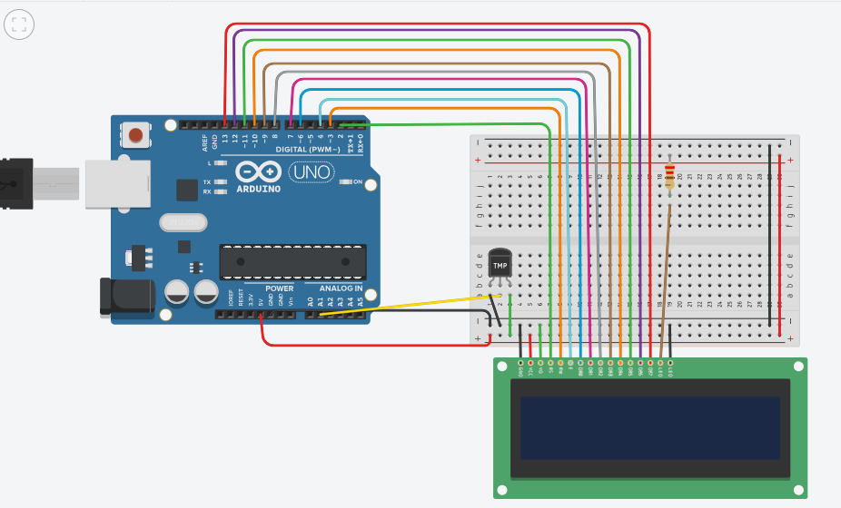

# *Nome do Projeto*

## Ideia

Criaremos um BOT do twitter, onde assim que o usuário perguntar a temperatura que está na sua casa, o Bot informará a temperatura de acordo com a captação do sensor.

## Diagrama de implantação

## Montagem do dispositivo

